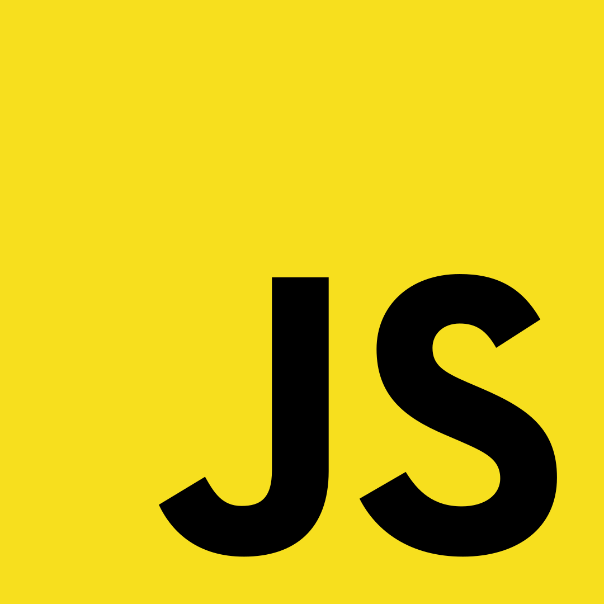
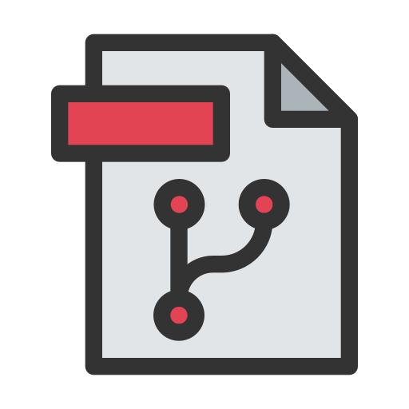
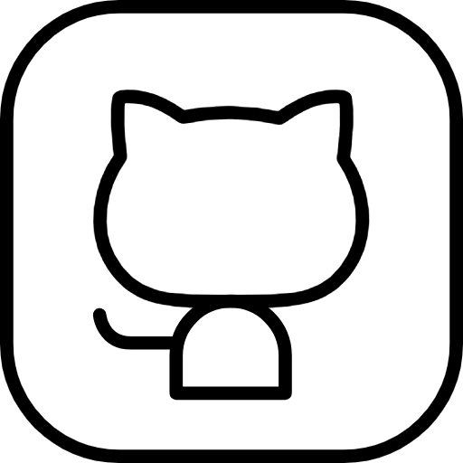

Hola,puedes llamarme Froggy 🐸. Soy estudiante de desarrollo Full Stack y me apasiona el mundo de la programación. En mis tiempos libres, disfruto enseñando y compartiendo lo que aprendo con otras personas.

Me encanta seguir creciendo como desarrollador, aprender nuevas tecnologías y motivar a otros a descubrir lo genial que es programar.

Aunque aún no tengo un canal de YouTube, estoy construyendo mi camino para compartir contenido educativo en el futuro.

  
  
    

