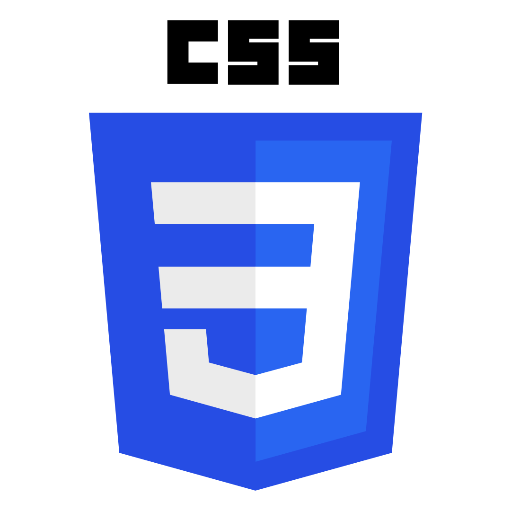

## 👋 ¡Hola, soy Froggy!

Soy estudiante de **Desarrollo Full Stack** con una gran pasión por el mundo de la programación. En mis tiempos libres, disfruto enseñar y compartir lo que aprendo con otras personas.

Me encanta seguir creciendo como desarrollador, explorar nuevas tecnologías y motivar a otros a descubrir lo genial que es programar.

Aunque aún no tengo un canal de YouTube, estoy construyendo mi camino para compartir contenido educativo en el futuro.

---

### 🛠️ Tecnologías con las que trabajo:

  
  
  
  
  
  

